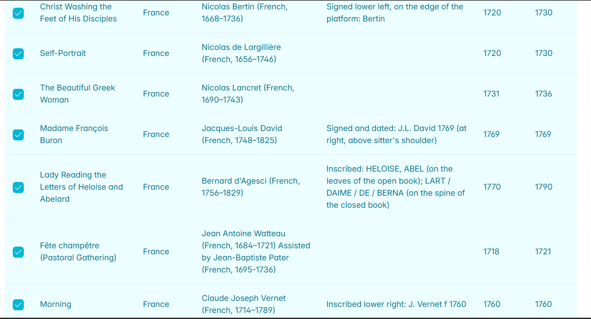
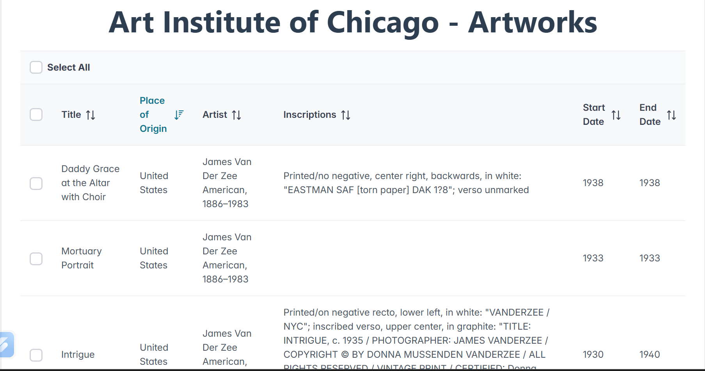
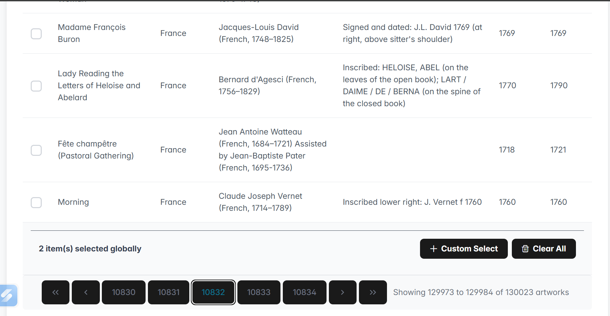

Artwork Table - React Application

A React application built with TypeScript and PrimeReact that displays artwork data from the Art Institute of Chicago API with server-side pagination and persistent row selection.

https://img.shields.io/badge/React-18.2.0-blue
https://img.shields.io/badge/TypeScript-5.0.0-blue
https://img.shields.io/badge/Vite-4.4.0-purple
https://img.shields.io/badge/PrimeReact-9.6.0-green

🚀 Features
📊 Data Table - Display artwork information in a professional table

🔄 Server-Side Pagination - Fetch data per page without storing all data

✅ Persistent Row Selection - Selections persist when navigating between pages

🎯 Custom Selection Overlay - Select specific number of rows through input field

📱 Responsive Design - Works on desktop and mobile devices

⚡ Fast Development - Built with Vite for optimal performance

🏷️ Type Safety - Full TypeScript implementation

🎨 Modern UI - PrimeReact components with professional styling

🛠️ Technologies Used
Frontend Framework: React 18 with TypeScript

Build Tool: Vite

<<<<<<< HEAD
UI Components: PrimeReact

Styling: PrimeFlex + CSS

HTTP Client: Axios

Icons: PrimeIcons

Package Manager: npm

📋 Assignment Requirements Met
Requirement	Status
Vite + TypeScript setup	✅
PrimeReact DataTable component	✅
Server-side pagination	✅
Persistent row selection	✅
Custom selection overlay	✅
No mass data storage	✅
No prefetching pages	✅
Individual row selection	✅
Select all on current page	✅
🎨 Data Fields Displayed
Title - Name of the artwork

Place of Origin - Where the artwork was created

Artist Display - Artist information

Inscriptions - Any inscriptions on the artwork

Date Start - Start date of creation

Date End - End date of creation

📦 Installation
Prerequisites
Node.js (version 16 or higher)

npm or yarn

Steps
Clone the repository

bash
git clone https://github.com/YOUR_USERNAME/react-artwork-table.git
cd react-artwork-table
Install dependencies

bash
npm install
Start the development server

bash
npm run dev
Open your browser
Navigate to http://localhost:3000 to view the application

🏗️ Build for Production
bash
# Build the project
npm run build

# Preview the production build
npm run preview
🚀 Deployment
This application can be deployed to any static hosting service:

Netlify
Build command: npm run build

Publish directory: dist

Cloudflare Pages
Build command: npm run build

Build output directory: dist

Vercel
Build command: npm run build

Output directory: dist

📁 Project Structure
text
src/
├── types/
│   └── artwork.ts          # TypeScript interfaces
├── App.tsx                 # Main application component
├── App.css                 # Application styles
├── main.tsx               # Application entry point
└── index.css              # Global styles
public/                    # Static assets
package.json               # Dependencies and scripts
vite.config.ts            # Vite configuration
tsconfig.json             # TypeScript configuration
.gitignore                # Git ignore rules
README.md                 # Project documentation
🔧 Key Implementation Details
Persistent Selection Strategy
Uses global Set objects to track selected and deselected artwork IDs

No prefetching of data from other pages

Selections persist across page navigation

Efficient memory usage

Server-Side Pagination
Fetches data per page from the API

No client-side storage of all data

Proper loading states during data fetching

Custom Selection Overlay
Allows users to input number of rows to select

Intelligently selects available rows on current page

Provides feedback for partial selections

🎯 API Integration
The application uses the Art Institute of Chicago API:

Base Endpoint: https://api.artic.edu/api/v1/artworks

Example Request:

typescript
const response = await axios.get(
  `https://api.artic.edu/api/v1/artworks?page=${page}&limit=${rowsPerPage}`
);
💡 Usage Instructions
Selecting Rows
Click checkboxes to select/deselect individual rows

Use "Select All" checkbox to select all rows on current page

Use "Custom Select" button to select specific number of rows

Navigation
Use pagination controls at the bottom to navigate between pages

Selected rows persist when changing pages

Clearing Selections
Use "Clear All" button to remove all selections across all pages

🐛 Troubleshooting
Common Issues
Build fails:

bash
# Clear node_modules and reinstall
rm -rf node_modules
npm install
TypeScript errors:

bash
# Check TypeScript compilation
npx tsc --noEmit
Port already in use:

bash
# Use different port
npm run dev -- --port 3001
🤝 Contributing
Fork the repository

Create a feature branch (git checkout -b feature/amazing-feature)

Commit your changes (git commit -m 'Add amazing feature')

Push to the branch (git push origin feature/amazing-feature)

Open a Pull Request

📄 License
This project is licensed under the MIT License - see the LICENSE file for details.

🙏 Acknowledgments
Art Institute of Chicago for providing the API

PrimeReact for the excellent UI components

Vite for the fast build tool

Screenshots



=======
export default defineConfig([
  globalIgnores(['dist']),
  {
    files: ['**/*.{ts,tsx}'],
    extends: [
      // Other configs...
      // Enable lint rules for React
      reactX.configs['recommended-typescript'],
      // Enable lint rules for React DOM
      reactDom.configs.recommended,
    ],
    languageOptions: {
      parserOptions: {
        project: ['./tsconfig.node.json', './tsconfig.app.json'],
        tsconfigRootDir: import.meta.dirname,
      },
      // other options...
    },
  },
])


```
>>>>>>> 7aa8f012efbab911d7214d2e45bb643a5668b8a1
